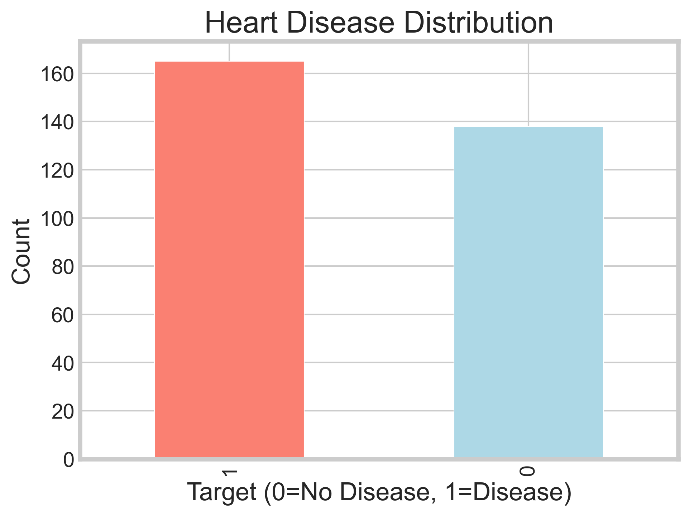
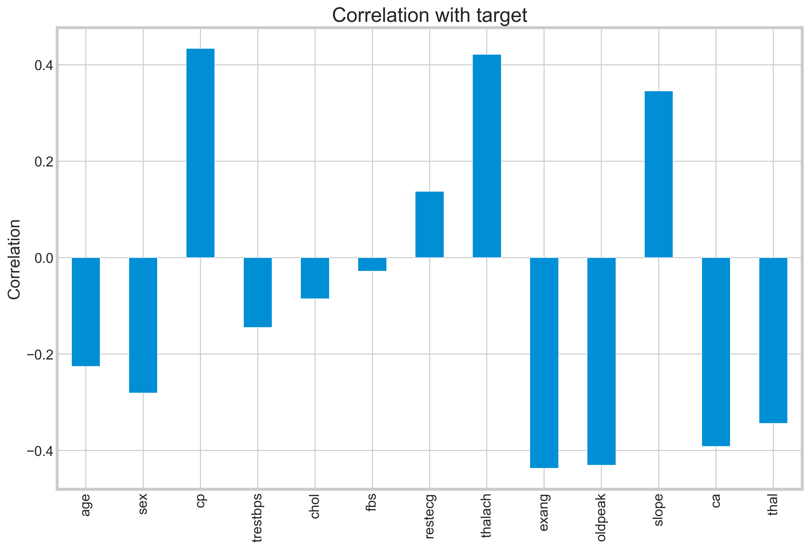
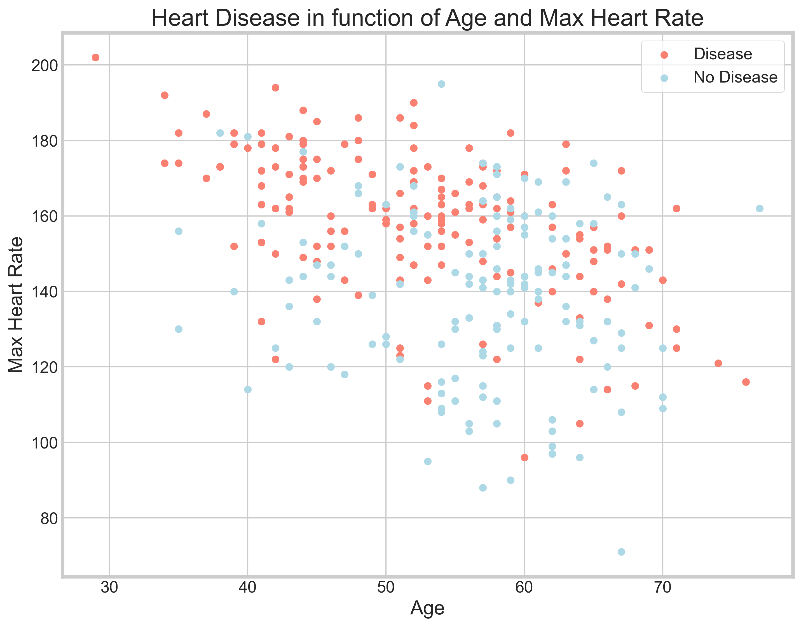

# ❤️ Heart Disease Prediction using Machine Learning

Predicting heart disease using medical diagnostic data with Logistic Regression. Achieved **86.81% accuracy** on test data.


---

## 🔍 Overview

Binary classification project predicting heart disease presence using patient medical diagnostic measurements. Implements comprehensive exploratory data analysis, feature engineering, and logistic regression modeling.

**Key Achievement**: 86.81% test accuracy with balanced performance across both classes

---

## 📊 Dataset

- **Source**: [UCI Heart Disease Dataset](https://www.kaggle.com/datasets/nzr8225/heart-disease-dataset)
- **Size**: 303 patients, 14 attributes
- **Target**: Binary (0 = No Disease, 1 = Disease)
- **Balance**: 165 with disease, 138 without (fairly balanced)

### Dataset Distribution

<p align="center">
  
</p>

**Key Features**: Age, Sex, Chest Pain Type, Blood Pressure, Cholesterol, Max Heart Rate, Exercise-Induced Angina

---

## 🎯 Key Visualizations

### Feature Importance

<p align="center">
  
</p>

**Top Predictors:**
- **cp (chest pain type)**: 0.43 correlation - strongest predictor
- **thalach (max heart rate)**: 0.42 correlation
- **exang (exercise angina)**: -0.44 correlation (negative)
- **oldpeak (ST depression)**: -0.43 correlation (negative)

### Age vs Maximum Heart Rate Analysis

<p align="center">
  
</p>

**Insights:**
- Patients with disease (red) tend to have lower max heart rates
- Age shows moderate correlation with heart disease
- Clear separation patterns visible in younger patients

---

## 🛠️ Methodology

### Data Preprocessing
- **Missing Values**: None detected
- **Feature Engineering**: One-hot encoding for categorical variables
- **Scaling**: StandardScaler for continuous variables (age, blood pressure, cholesterol, heart rate, ST depression)
- **Train/Test Split**: 70% training, 30% testing

### Exploratory Data Analysis
- Distribution analysis of target variable
- Categorical vs continuous feature identification
- Feature correlation analysis
- Age vs max heart rate scatter plot
- Correlation heatmap generation

### Model Training
- **Algorithm**: Logistic Regression
- **Solver**: liblinear
- **Cross-validation**: Train/test split validation

---

## 📈 Results

| Metric | Training | Testing |
|--------|----------|---------|
| **Accuracy** | 86.79% | 86.81% |
| **Precision (No Disease)** | 88% | 87% |
| **Precision (Disease)** | 86% | 87% |
| **Recall (No Disease)** | 82% | 83% |
| **Recall (Disease)** | 90% | 90% |

### Confusion Matrix

|  | Predicted No Disease | Predicted Disease |
|---|---|---|
| **Actual No Disease** | 34 | 7 |
| **Actual Disease** | 5 | 45 |

### Key Findings

- ✅ **Excellent generalization**: Test accuracy matches training accuracy
- ✅ **Balanced performance**: Similar precision/recall for both classes
- ✅ **High recall for disease detection**: 90% - crucial for medical diagnosis
- ✅ **No overfitting**: Consistent performance across train/test sets
- ✅ **Low false negatives**: Only 5 disease cases missed out of 50

### Important Correlations

From correlation analysis:
- **Weakest predictors**: fbs (fasting blood sugar) and chol (cholesterol)
- **Strongest predictors**: cp (chest pain type), thalach (max heart rate), exang (exercise angina)
- **Negative correlations**: Lower max heart rate and ST depression indicate higher disease risk

---

## 🖥️ How to Run

### 1. Clone Repository
```bash
git clone https://github.com/SergioSediq/heart-disease-prediction-ml.git
cd heart-disease-prediction-ml
```

### 2. Set Up Environment
```bash
# Create virtual environment
python -m venv venv

# Activate
# Windows:
venv\Scripts\activate
# macOS/Linux:
source venv/bin/activate

# Install dependencies
pip install -r requirements.txt
```

### 3. Get Dataset
1. Download `heart.csv` from [Kaggle](https://www.kaggle.com/datasets/johnsmith88/heart-disease-dataset)
2. Place in `data/` directory

### 4. Run Pipeline
```bash
python heart_disease_prediction.py
```

**Expected Runtime**: ~30 seconds  
**Output**: All plots saved to `results/`, metrics in console

---

## 📦 Technologies

**Core**: Python 3.8+, pandas, numpy, scikit-learn  
**Visualization**: matplotlib, seaborn  
**Techniques**: One-hot Encoding, StandardScaler, Logistic Regression

---

## 📁 Project Structure
```
heart-disease-prediction-ml/
├── data/
│   └── heart.csv                       # Dataset (download separately)
├── results/                             # Auto-generated outputs
│   ├── 01_target_distribution.png
│   ├── 02_categorical_features.png
│   ├── 03_continuous_features.png
│   ├── 04_age_vs_heartrate.png
│   ├── 05_correlation_matrix.png
│   ├── 06_target_correlation.png
│   └── model_results.csv               # Final metrics
├── heart_disease_prediction.py         # Main ML pipeline
├── requirements.txt
└── README.md
```

---

## 💡 Key Learnings

- Handling medical diagnostic data with imbalanced but manageable class distribution
- Feature correlation analysis for medical predictions
- One-hot encoding for categorical medical variables (chest pain type, ECG results, etc.)
- Balanced classification performance optimization
- Model evaluation for healthcare applications where false negatives are critical
- The importance of interpretable models in medical diagnosis

---

## 🔬 Further Improvements

Potential enhancements for future iterations:
- Cross-validation with k-fold splitting
- Hyperparameter tuning with GridSearchCV
- Feature selection using RFE
- Comparison with other algorithms (Random Forest, XGBoost)
- ROC-AUC curve analysis
- SHAP values for model interpretability

---

## 📧 Contact

**Sergio Sediq**  
📧 tunsed11@gmail.com  
🔗 [LinkedIn](https://linkedin.com/in/sedyagho) | [GitHub](https://github.com/SergioSediq)

---

## 📄 License

This project is open source and available under the MIT License.

---

⭐ **Star this repo if you found it helpful!**
